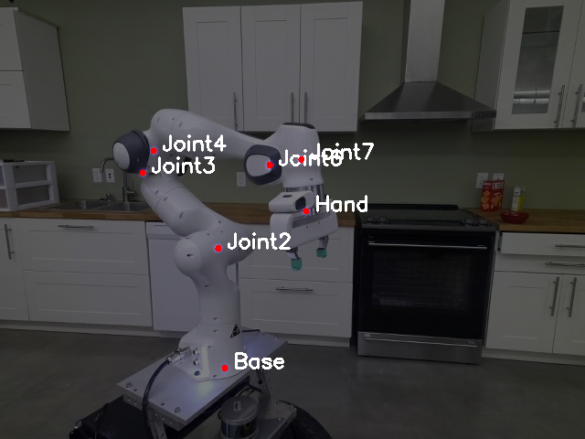
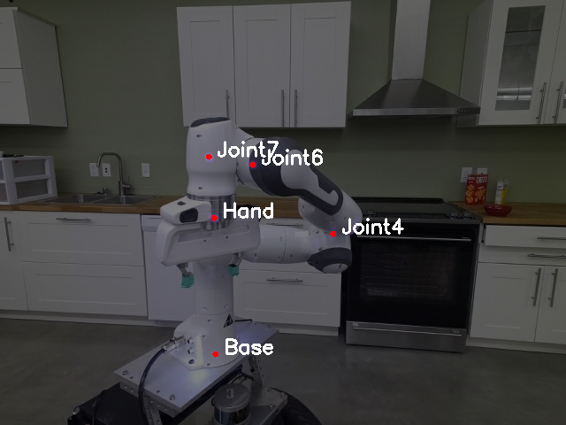

[Report of the project](https://drive.google.com/file/d/1kfFgt6tH3ZoA3aqDwPEZPkCZexhNW4yv/view?usp=sharing)

## Pose keypoints perfectly detected (Left) Pose of missing keypoints prediction with occuled/overlapped joints (Right) 

<p align="center">


</p>


## Experiments Results
Performance Comparison of percentage out-of-frame gt keypoints not found (correct),
percentage in-frame gt keypoints found (correct) and L2 error (px) for in-frame keypoints area under the curve (AUC)

<div align="center">

| **Model**          | **Out-of-frame** | **In-frame** | **In-frame AUC** |
|--------------------|------------------|--------------|------------------|
| VGG (Basline)      | 68.76            | 89.87        | 65.18            |
| VGG-MHA            | **99.52**        | 85.71        | 65.65            |
| VGG-ATT            | 98.74            | **89.91**    | **67.72**        |
| VGG-Transformer    | 98.27            | 86.28        | 62.70            |

</div>

## Training 

```shell
python train_network.py -i data/synthetic/panda_synth_train_dr/ -t 0.8 -m manip_configs/panda.yaml -ar arch_configs/dream_vgg_f_attlast.yaml -e 1 -lr 0.00015 -b 128 -w 16 -o model_vgg_f_attlast_0607
```

## Azure Dataset Inference
```shell
python network_inference_dataset.py -i model_vgg_f_attlast_0607/best_network.pth -d data/real/panda-3cam_azure/ -o output_vgg_f_attlast_0607 -b 16 -w 8
```
## Single Image Inference
```shell
python network_inference.py -i model_vgg_f/best_network.pth -m data/real/panda-3cam_azure/000000.rgb.jpg
```

## Plotting 
### OKS for PCK

```shell
python oks_plots.py --data output_vgg_f_0603/keypoints.csv output_vgg_f_mha_0605/keypoints.csv output_vgg_f_attlast_0607/keypoints.csv output_vgg_f_transformer_0605/keypoints.csv \
--show --output "vgg_f_mha_0605_PCK" --colours 0 1 2 3 4 --labels "VGG" "VGG-MHA" "VGG-Att" "VGG-Transformer"  

```

### ADD for PnP

```shell
python add_plots.py --data  output_vgg_f_0603/pnp_results.csv output_vgg_f_mha_0605/pnp_results.csv output_vgg_f_attlast_0607/pnp_results.csv output_vgg_f_transformer_0605/pnp_results.csv \
--show --output "vgg_f_mha_0605_ADD" --colours 0 1 2 3 4 --labels "VGG" "VGG-MHA" "VGG-Att" "VGG-Transformer"
```

## Run Both at once 
```shell
bash visualization.sh
``` 

# Visualization for traning and validation loss

```
visualize_loss.ipynb
```
